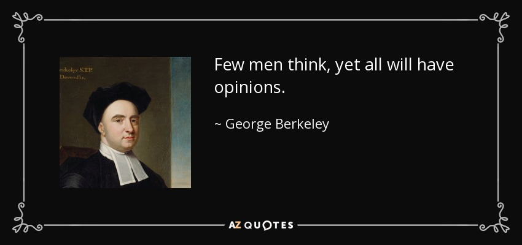

= Zitate

Die Sammlung meiner Lieblingszitate.

Wie alle Unterteilungen ist auch die nun folgende völlig willkürlich
und beliebig.

== Der Philosoph und der Rest

{empty}

Die Vorstellungen und Begriffe des gemeinen Mannes von der Welt werden
nicht durch die volle, reine Erkenntnis als Selbstzweck, sondern durch
das Streben nach günstiger Anpassung an die Lebensbedingungen gebildet
und beherrscht. Darum sind sie weniger genau, bleiben aber dafür auch
vor den Monströsitäten bewahrt, welche bei einseitiger eifriger
Verfolgung eines wissenschaftlichen (philosophischen) Gesichtspunktes
sich leicht ergeben ... Der philosophische Standpunkt des gemeinen
Mannes, wenn man dessen naivem Realismus diesen Namen zuerkennen will,
hat Anspruch auf die höchste Wertschätzung. Derselbe hat sich ohne das
absichtliche Zutun des Menschen in unmeßbar langer Zeit ergeben; er ist
ein Naturprodukt und wird durch die Natur erhalten. Alles, was die
Philosophie geleistet hat - die biologische Berechtigung jeder Stufe, ja
jeder Verirrung zugestanden - ist dagegen nur ein unbedeutendes
ephemeres Kunstprodukt. Und wirklich sehen wir jeden Denker, auch jeden
Philosophen, sobald er durch praktische Bedrängnis aus seiner
einseitigen intellektuellen Beschäftigung vertrieben wird, sofort den
allgemeinen Standpunkt einnehmen. +
xref:Quellen#Mach[Mach I.15.]

Diese Lehre hier, ihren Sinn, der Wirklichkeit hat, zu verstehen, werden
immer die Menschen zu töricht sein, so ehe sie gehört, wie wenn sie erst
gehört haben. Denn geschieht auch alles nach diesem Sinn, so sind sie
doch wie Unerfahrene - trotz all ihrer Erfahrung mit derlei Worten und
Werken, wie ich hier sie eingehend auseinanderlege einzeln ihrem Wesen
nach und erkläre, wie sich jedes verhält; den andern Menschen aber
bleibt unbewußt, was sie im Wachen tun, wie was sie im Schlaf bewußtlos
tun. +
xref:Quellen#Heraklit-F[Heraklit-F]

Denn viele sehn das nicht ein, soviele auch daran stoßen; belehrt man
sie auch, sie erkennen es nicht - aber sie bilden sich etwas ein. +
xref:Quellen#Heraklit-F[Heraklit-F]

Dem Blöden fährt bei jedem sinnvollen Wort der Schrecken in die
Glieder. +
xref:Quellen#Heraklit-F[Heraklit-F]

{empty}8. In des Nichtwissens Tiefe hin sich windend, +
Sich selbst als Weise, als Gelehrte wähnend, +
So stoßen ziellos sich herum die Toren, +
Wie Blinde, die ein selbst auch Blinder anführt. +
9. Im Nichtwissen vielfältig hin sich windend, +
Am Ziel der Wünsche wähnen sich die Toren; +
Vor Werkdienst kommen sie nicht zur Besinnung, +
Der Not verfallend, wenn der Lohn verbraucht ist. +
xref:Quellen#Mundaka-Upanishad[Mundaka-Upanishad]

== Über den Weg zur Erkenntnis

Ich richtete mein Herz darauf, zu erkennen die Weisheit und zu schauen
die Mühe, die auf Erden geschieht, daß einer weder Tag noch Nacht Schlaf
bekommt in seine Augen. Und ich sah alles Tun Gottes, daß ein Mensch das
Tun nicht ergründen kann, das unter der Sonne geschieht. Und je mehr der
Mensch sich müht, zu suchen, desto weniger findet er. Und auch wenn der
Weise meint: „Ich weiß es“, so kann er's doch nicht finden. +
xref:Quellen#Prediger[Prediger Salomo 8]

»Die Welt ist meine Vorstellung:« – dies ist die Wahrheit, welche in
Beziehung auf jedes lebende und erkennende Wesen gilt; wiewohl der
Mensch allein sie in das reflektirte abstrakte Bewußtseyn bringen kann:
und thut er dies wirklich; so ist die philosophische Besonnenheit bei
ihm eingetreten. Es wird ihm dann deutlich und gewiß, daß er keine Sonne
kennt und keine Erde; sondern immer nur ein Auge, das eine Sonne sieht,
eine Hand, die eine Erde fühlt; daß die Welt, welche ihn umgiebt, nur
als Vorstellung da ist, d.h. durchweg nur in Beziehung auf ein Anderes,
das Vorstellende, welches er selbst ist. +
xref:Quellen#Schopenhauer-D[Schopenhauer-D]

Die großen Philosophen ... haben verstanden oder gefühlt, daß jede
sprachliche Formulierung die Wirklichkeit nicht nur ergreift, sondern
auch gestaltet und idealisiert, und daß eben in dem Maß, in dem die
Begriffe sich verschärfen, die Idealisierung sich wieder von der
Wirklichkeit löst; daher auch werden die letzten, tiefsten Erkenntnisse
schließlich im Gleichnis ausgesprochen. +
xref:Quellen#Heisenberg-O[Heisenberg-O]

Vielwisserei lehrt keine Vernunft; sonst hätte sie Hesiod belehrt und
Pythagoras, auch Xenophanes und Hekataios. Denn das Weise ist das Eine:
den einsichtsvollen Willen zu verstehen, der alles durch alles
hindurchsteuert. +
xref:Quellen#Heraklit-F[Heraklit-F]

{empty}11. Nur wer es nicht erkennt, kennt es, +
Wer es erkennt, der weiß es nicht, — +
Nicht erkannt vom Erkennenden, +
Erkannt vom Nicht-Erkennenden! +
12. In wem es aufwacht, der weiß es +
Und findet die Unsterblichkeit; +
Daß er es selbst ist, gibt Kraft ihm, +
Daß er dies weiß, Unsterblichkeit. +
13. Wer ihn hienieden fand, besitzt die Wahrheit, +
Wer ihn hier nicht fand, dem ist's groß Verderben. +
In jedem Wesen nimmt ihn wahr der Weise +
Und wird, hinscheidend aus der Welt, unsterblich. +
xref:Quellen#Upanishad[Kena-Upanishad, Zweiter Khanda]

{empty}14. Steht auf! wacht auf! erlangt habend +
Treffliche Lehrer, merkt auf sie. +
Wie schwer zu gehn auf scharfer Messerschneide ist, +
Schwer ist der Weg! Den lehren euch die Weisen. +
xref:Quellen#Upanishad[Kathaka-Upanishad, Erster Adhyaya, Dritte Valli]

Schwervollbringbar, schwererreichbar, +
Schwer zu schauen, zu gründen schwer, +
Schwer ausführbar ist dies Sinnen +
Selbst für Weise und Einsame. +
xref:Quellen#Upanishad[Tejobindu-Upanishad]

Nicht Grobes erkennend und nicht Feines erkennend, noch nach beiden
Seiten erkennend, weder bewusst noch unbewusst, auch nicht durch und
durch aus Erkenntnis bestehend, unsichtbar, unbetastbar, ungreifbar,
uncharakterisierbar, undenkbar, unbezeichenbar, nur in der Gewissheit
des eigenen Selbstes gegründet, die ganze Weltausbreitung auslöschend,
selig, beruhigt, zweitlos, – das ist {startsb}das vierte Viertel{endsb}, das« eben
»ist der Âtman, den« eben »soll man erkennen«, – +
und auch der Îçvara (der persönliche Gott) wird verschlungen von dem
Turîya (dem Vierten), – von dem Turîya! +
xref:Quellen#Upanishad[Nrisinha-Uttara-Tâpanîya-Upanishad]

Wie fließende Ströme im Meer verschwinden, ihren Namen und ihre Form
verlieren, so schreitet ein weiser Mensch, von Namen und Gestalt
befreit, in die göttliche Weisheit ein, die über allem steht. +
xref:Quellen#Yajnavalkya-D[Yajnavalkya-D]

Und wer auch immer, Ananda, jetzt oder nach seinem Tode sich selbst
Richtschnur sein wird, sich selbst Zuflucht sein wird, keine äußere
Zuflucht suchen wird, sondern zur Wahrheit stehen wird als zu seiner
Richtschnur ... und zu niemandem Zuflucht nehmen wird , wird außer zu
sich selbst - er ist der, der die allerhöchste Höhe erreichen wird. Doch
er muß eifrig bestrebt sein zu lernen. +
xref:Quellen#Buddha-D[Buddha-D]

Wissen ist eine Sache des Intellekts; es stellt sich in Begriffen dar
und erhält Urteile über falsch und richtig, für und wider, also
Ausschließungen, so daß es nur Bruchstücke der Wirklichkeit erfassen
kann. Weisheit aber ist ein Gegensätze transzendierendes Einswerden
[Anmerkung: eigentlich nicht Einswerden sondern Erkennen des Einsseins]
mit der Wirklichkeit *alles* Daseienden, etwas Erlebnishaftes, das nach
Abwerfen rationaler Beschränkungen, aller Ansichten und Lehren erfahren
wird. Sie wird als „All-Wissenheit“ (sarvajnata) definiert und steht im
Mahayana sysnonym für „Erleuchtung“ (bodhi)... +
Indem er durchschaut, daß alles Existierende {startsb}Anmerkung: dies sind die
Objektivationen des Willens bei Schopenhauer{endsb} ein Produkt fluktuierender
Dharmas ist {startsb}Anmerkung: eben des Willens{endsb}, erkennt er die Leerheit
{startsb}Anmerkung: das Undingliche, das Gesetz bei Heisenberg oder Dürr{endsb} als
die einzige Wirklichkeit in allen Erscheinungen. Zugleich erlebt er sie
als mit der Soheit der Welt und der Buddhaheit der Buddhas identisch: in
der Leerheit durchschaut er die Wesen und Buddhas als eins und erlöst.
Zwischen einem Buddha und einem Weltmenschen, so geht ihm auf, besteht
kein wesenhafter Unterschied. Ein Buddha lediglich ist sich seiner
Buddhaheit bewußt - er *weiß*, daß er ein Buddha ist. Im Weltling
dagegen ist die Buddhanatur unter Unwissenheit verschüttet. In
Unkenntnis seiner Buddhaheit hält er sich für unerlöst. +
Die Weisheitserkenntnis der Leerheit verändert die Haltung des Menschen
von Grund auf. Nicht nur durchschaut er das samsarische Leiden als
Schein und Traum - auch Buddhaschaft und Nirvana haben für ihn den Wert
verloren. Sie sind illusionäre Ideale, nützlich nur für den, der nichts
von seiner wesenhaften Erlöstheit weiß. +
xref:Quellen#Schumann[Schumann S.174-175]

== Über den Weg zum Glück

Die Gold suchen, graben viel Erde und finden wenig. +
xref:Quellen#Heraklit-F[Heraklit-F]

{empty}12. Wenn seine Seele blind ist durch die Mâyâ, +
Bewohnt den Leib er und betreibt die Werke, +
Durch Weiber, Speise, Trank und viel Genüsse +
Erlangt er Sättigung im Stand des Wachens. +
xref:Quellen#Upanishad[Kaivalya-Upanishad]

Darüber ist auch dieser Vers: +
9. Vor dem die Worte umkehren +
Und das Denken, nicht findend ihn, +
Wer dieses Brahman's Wonne kennt, +
Der fürchtet sich vor keinem mehr. +
Ihn, fürwahr, quälen nicht mehr die Fragen: „Welches Gute habe ich
unterlassen?“ — „Welches Böse habe ich begangen?“ — Wer, solches
wissend, sich von diesen hin zum Atman rettet, der rettet sich zugleich
von beiden {startsb}Gutem und Bösem{endsb} hin zum Atman, — wer solches weiß. — So
lautet die Upanishad. +
xref:Quellen#Upanishad[Taittiriya-Upanishad, Anandavalli]

{empty}14. Wenn alle Leidenschaft schwindet, +
Die nistet in des Menschen Herz, +
Dann wird, wer sterblich, unsterblich, +
Hier schon erlangt das Brahman er. +
xref:Quellen#Upanishad[Kathaka-Upanishad, Zweiter Adhyaya, Sechste Valli]

{empty}9. Spalt' hundertmal des Haars Spitze +
Und nimm davon ein Hundertstel, +
Das denk' als Größe der Seele, +
Und sie wird zur Unendlichkeit. +
10. Er ist nicht weiblich, nicht männlich, +
Und doch ist er auch sächlich nicht; +
Je nach dem Leib, den er wählte, +
Steckt er in diesem und in dem. +
11. Durch Wahn des Vorstellens, Berührens, Sehens, +
Fährt er als Seele, seinem Werk entsprechend, +
Durch Essens, Trinkens, Zeugens Selbsterschaffung, +
Abwechselnd hier und dort in die Gestalten. +
12. Als Seele wählt viel grobe und auch feine +
Gestalten er, entsprechend seiner Tugend; +
Und was ihn band, kraft seines Werks und Selbstes, +
In diese, bindet wieder ihn in andre. +
13. Wer ihn, anfanglos, endlos, in dem Gemenge +
Als Weltenschöpfer vielfach sich gestaltend. +
Den Einen, der das Weltall hält umschlossen, +
Als Gott kennt, wird befreit von allen Banden. +
14. Wer im Herzen den nestlosen (leiblosen), +
Sein und Nichtsein bewirkenden. +
Die {startsb}sechzehn{endsb} Teile bindenden +
Sel'gen Gott sucht, verläßt den Leib. +
xref:Quellen#Upanishad[Svetasvatara-Upanishad, Fünfter Adhyaya]

Wenn ihn der Seher schaut, wie Goldschmuck strahlend, +
Den Schöpfer, Herrn und Geist, die Brahmanwiege, +
Dann gibt der Weise Gutes auf und Böses, +
Einsmachend alles in dem Ew'gen, Höchsten. +
xref:Quellen#Upanishad[Maytrayana-Upanishad, Sechster Prapathaka]

{empty}6. Der Schauende schaut nicht den Tod, +
Nicht Krankheit und nicht Ungemach, +
Das All nur schaut der Schauende, +
Das All durchdringt er allerwärts. +
xref:Quellen#Upanishad[Maytrayana-Upanishad, Siebenter Prapathaka]

{empty}8. Wer jenes Höchst-und-Tiefste schaut, +
Dem spaltet sich des Herzens Knoten, +
Dem lösen alle Zweifel sich, +
Und seine Werke werden Nichts. +
xref:Quellen#Upanishad[Mundaka-Upanishad, Zweites Mundakam]

Das aber verkünde ich, o Freund: in eben diesem klafterhohen, mit
Wahrnehmung und Bewußtsein versehenen Körper, da ist die Welt enthalten,
der Welt Entstehung, der Welt Ende und der zu der Welt Ende führende
Pfad. +
xref:Quellen.adoc#[Anguttara Nikaya IV 45]

Leidvoll ist Lust, o Eraka! +
Nicht Glück bringt Lust, o Eraka! +
Wer sich nach Sinnenlüsten sehnt, +
ersehnt das Leiden, Eraka! +
Wer Sinnenlüste nicht ersehnt, +
ersehnt nicht Leiden, Eraka! +
xref:Quellen#Theragata[Theragata 93]

{empty}(1) Dies sind die geheimen Worte, die Jesus, der Lebendige,
sprach und die +
Didymus Judas Thomas niedergeschrieben hat. +
Und er sprach: „Wer die Bedeutung dieser Worte findet, wird +
den Tod nicht schmecken.“ +
(2) Jesus sprach: „Wer sucht, soll nicht aufhören zu suchen, bis er
findet; +
und wenn er findet, wird er erschrocken sein; und wenn er erschrocken
ist, +
wird er verwundert sein, und er wird über das All herrschen.?“ +
(3) Jesus sprach: „Wenn die, die euch führen, euch sagen: Seht, das +
Königreich ist im Himmel, so werden die Vögel des Himmels euch +
vorangehen. Wenn sie euch sagen: es ist im Meer, so werden die Fische +
euch vorangehen. Aber das Königreich ist in euch, und es ist außerhalb
von +
euch. +
Wenn ihr euch erkennen werdet, dann werdet ihr erkannt, und ihr werdet +
wissen, das ihr die Söhne des lebendigen Vaters seid. Aber wenn ihr
euch +
nicht erkennt, dann seid ihr in der Armut, und ihr seid die Armut.?“ +
(4) Jesus sprach: „Der betagte Mensch wird nicht zögern, ein kleines
Kind +
von sieben Tagen zu fragen nach dem Ort des Lebens, und er wird +
leben. Denn viele Erste werden Letzte werden, und sie werden ein
einziger +
werden.?“ +
(37) Seine Jünger sprachen: „Wann wirst du uns offenbar werden, und
wann +
werden wir dich sehen?“ +
Jesus sprach: „Wenn ihr euch entkleidet ohne Scham und eure Kleider +
nehmt und sie unter eure Füße legt wie die kleinen Kinder und auf sie
tretet, +
dann werdet ihr den Sohn des Lebendigen {startsb}sehen{endsb} und ihr werdet euch
nicht +
fürchten.“ +
(42) Jesus sprach: „Werdet Vorübergehende!“ +
(51) Seine Jünger sprachen zu ihm: „Wann wird die Ruhe der Toten +
eintreten, und wann wird die neue Welt kommen?“ +
Er sprach zu ihnen: „Was ihr erwartet, ist gekommen, aber ihr erkennt
es +
nicht.“ +
(63) Jesus sprach: „Es war ein begüterter Mann, der viel Reichtum hatte.
Er +
sprach: Ich werde meine Reichtümer benutzen, um zu säen, zu ernten, zu +
pflanzen, meine Speicher mit Frucht zu füllen, auf daß mir nichts fehle.
Das +
war es, was in seinem Herzen dachte. Und in jener Nacht starb er. Wer +
Ohren hat, möge hören.“ +
(113) Seine Jünger sprachen zu ihm: „Das Königreich, wann wird es +
kommen?“ +
Jesus sprach: „Es wird nicht kommen, wenn es erwartet wird. Man wird +
nicht sagen: Seht, hier, oder seht, dort. Sondern das Königreich des
Vaters +
ist ausgebreitet über die Erde, und die Menschen sehen es nicht.“ +
xref:Quellen#Thomas[Thomas]

Daher meint jeder nur von sich zu wissen, indem er sich für eine
untrennbare von anderen unabhängige Einheit hält. Bewußstseinsinhalte
von allgemeiner Bedeutung durchbrechen aber diese Schranken des
Individuums und führe, natürlich wieder an Individuen gebunden,
unabhängig von der Person, durch die sie sich entwickelt haben, ein
allgemeineres unpersönliches, überpersönliches Leben fort. Zu diesem
beizutragen, gehört zum größten Glück des Künstlers, Forschers,
Erfinders, Sozialreformators u. s. w. +
Das Ich ist unrettbar. Teils diese Einsicht, teils die Furcht vor
derselben führen zu den absonderlichsten pessimistischen und
optimistischen, religiösen, asketischen und philosophischen
Verkehrtheiten. Der einfachen Wahrheit, welche sich aus der
psychologischen Analyse ergibt, wird man sich auf die Dauer nicht
verschließen können. Man wird dann auf das Ich, welches schon während
des individuellen Lebens variiert, ja im Schlaf und bei Versunkenheit in
eine Anschauung, in einen Gedanken, gerade in den glücklichsten
Augenblicken, teilweise oder ganz fehlen kann, nicht mehr den hohen Wert
legen. Man wird dann auf individuelle xref:Quellen.adoc#[Anmerkung: abgeteilte]
Unsterblichkeit gern verzichten, und nicht auf das Nebensächlich mehr
Wert legen als auf die Hauptsache. Man wird hierdurch zu einer freieren
und verklärten Lebensauffassung gelangen, welche Mißachtung des fremden
Ich und Überschätzung des eigenen ausschließt. +
xref:Quellen#Mach[Mach I.12.]

An die wenigen Erfahrungen, welche ich bis jetzt auf dem Wege zu meinem
eigentlichen Lebensziel gefunden hatte, reihte sich diese neue: das
Betrachten solcher Gebilde, das Sichhingeben an irrationale, krause,
seltsame Formen der Natur erzeugt in uns ein Gefühl von der
Übereinstimmung unseres Innern mit dem Willen, der diese Gebilde werden
ließ — wir spüren bald die Versuchung, sie für unsere eigenen Launen,
für unsere eigenen Schöpfungen zu halten — wir sehen die Grenzen
zwischen uns und der Natur zittern und zerfließen und lernen die
Stimmung kennen, in der wir nicht wissen, ob die Bilder auf unserer
Netzhaut von äußeren Eindrücken stammen oder von inneren. Nirgends so
einfach und leicht wie bei dieser Übung machen wir die Entdeckung, wie
sehr wir Schöpfer sind, wie sehr unsere Seele immerzu teilhat an der
beständigen Erschaffung der Welt. Vielmehr ist es dieselbe unteilbare
Gottheit, die in uns und die in der Natur tätig ist, und wenn die äußere
Welt unterginge, so wäre einer von uns fähig, sie wieder aufzubauen,
denn Berg und Strom, Baum und Blatt, Wurzel und Blüte, alles Gebildete
in der Natur liegt in uns vorgebildet, stammt aus der Seele, deren Wesen
Ewigkeit ist, deren Wesen wir nicht kennen, das sich uns aber zumeist
als Liebeskraft und Schöpferkraft zu fühlen gibt. +
xref:Quellen.adoc#Demian[Demian]

== Das Wesen der Welt

Nicht die Körper erzeugen Empfindungen, sondern Empfindungskomplexe
bilden die Körper. Erscheinen dem Physiker die Körper als das Bleibende,
Wirkliche, die Empfindungen hingegen als ihr flüchtiger vorübergehender
Schein, so beachtet er nicht, daß alle Körper nur Gedankensymbole für
Empfindungskomplexe sind ... Die Welt besteht also für uns nicht aus
rätselhaften Wesen, welche durch Wechselwirkung mit einem anderen ebenso
rätselhaften Wesen, dem Ich, die allein zugänglichen Empfindungen
erzeugen. Die Farben, Töne, Räume, Zeiten . . . sind für uns die letzten
Elemente. Darin besteht eben die Ergründung der Wirklichkeit. +
xref:Quellen#Mach[Mach I.13.]

{empty}... weil ... ein großer Passagierdampfer an uns vorbeiglitt ... Was war
der Dampfer wirklich? War er eine Masse Eisen mit einer Kraftzentrale,
einem elektrischen Leitungssystem und Glühbirnen? Oder war er der
Ausdruck einer menschlichen Absicht, eine Gestalt, die sich als Ergebnis
der zwischenmenschlichen Beziehungen gebildet hat? Oder war er die Folge
der biologischen Naturgesetze, die als Objekt für ihre Gestaltungskraft
diesmal nicht nur Eiweißmoleküle, sondern Stahl und elektrische Ströme
verwendet hatten? Stellt das Wort „Absicht“ also nur den Reflex dieser
gestaltenden Kraft oder der Naturgesetze im menschlichen Bewußtsein
dar? +
xref:Quellen#Heisenberg-G[Heisenberg-G, Kap. 17]

Nach dem Abschluss dieser Entwicklung {startsb}der physikalischen Wissenschaft{endsb}
scheinen die Wörter: „Materie“, „Kraft“, „Struktur von Raum und Zeit“
nur verschiedene Seiten des gleichen Geschehens zu bezeichnen. Die
hierdurch erreichte Vereinheitlichung hat dabei zur Folge, dass keiner
dieser Begriffe ohne Vorbehalt in dem einfachen ursprünglichen Sinne
verwendet werden kann, sofern es sich nicht um Vorgänge im Bereich der
täglichen Erfahrung handelt. +
xref:Quellen#Heisenberg-O[Heisenberg-O]

Alle Elementarteilchen sind aus derselben Substanz, aus demselben Stoff
gemacht, den wir nun Energie oder universelle Materie nennen können; sie
sind nur verschiedene Formen, in denen Materie erscheinen kann. +
xref:Quellen#Heisenberg-P[Heisenberg-P]

Offenbar sind doch z.B. die folgenden biologischen Abläufe innerlich eng
verwandt und gewissermaßen nur dem Grade nach verschieden: Der Aufbau
eines Organs aus vielen gleichartigen Zellen; die Bildung eines nach
bestimmten Gesetzen lebenden Ameisenstaates, der fast ebenso wie das
Organ als etwas Ganzes reagiert; der Zusammenschluß von Menschen zu
einer Gemeinschaft. +
xref:Quellen#Heisenberg-O[Heisenberg-O]

{empty}...Zweiteilung und Symmetrieverminderung, das ist des Pudels Kern. Zweiteilung ist ein sehr altes Attribut des Teufels (das Wort „Zweifel“ soll ursprünglich Zweiteilung bedeutet haben). Ein Bischof in einem Stück von Bernard Shaw sagt: "A fair play for the devil please". Darum soll er auch zum Weihnachtsfest nicht fehlen. Die beiden göttlichen Herren - Christus und Teufel - sollen nur merken, daß sie inzwischen viel symmetrischer geworden sind. +
xref:Quellen#Heisenberg-G[Heisenberg-G Kap. 17, Zitat aus einem Brief Wolfgang Paulis an Werner Heisenberg]

Meine Herren, als Physiker, der sein ganzes Leben der nüchternen
Wissenschaft, der Erforschung der Materie widmete, bin ich sicher von
dem Verdacht frei, für einen Schwarmgeist gehalten zu werden. Und so
sage ich nach meinen Erforschungen des Atoms dieses: Es gibt keine
Materie an sich. Alle Materie entsteht und besteht nur durch eine Kraft,
welche die Atomteilchen in Schwingung bringt und sie zum winzigsten
Sonnensystem des Alls zusammenhält. Da es im ganzen Weltall aber weder
eine intelligente Kraft noch eine ewige Kraft gibt - es ist der
Menschheit nicht gelungen, das heißersehnte Perpetuum mobile zu erfinden
- so müssen wir hinter dieser Kraft einen bewußten intelligenten Geist
annehmen. Dieser Geist ist der Urgrund aller Materie. Nicht die
sichtbare, aber vergängliche Materie ist das Reale, Wahre, Wirkliche -
denn die Materie bestünde ohne den Geist überhaupt nicht - , sondern der
unsichtbare, unsterbliche Geist ist das Wahre! Da es aber Geist an sich
ebenfalls nicht geben kann, sondern jeder Geist einem Wesen zugehört,
müssen wir zwingend Geistwesen annehmen. Da aber auch Geistwesen nicht
aus sich selber sein können, sondern geschaffen werden müssen, so scheue
ich mich nicht, diesen geheimnisvollen Schöpfer ebenso zu benennen, wie
ihn alle Kulturvölker der Erde früherer Jahrtausende genannt haben:
Gott! Damit kommt der Physiker, der sich mit der Materie zu befassen
hat, vom Reiche des Stoffes in das Reich des Geistes. Und damit ist
unsere Aufgabe zu Ende, und wir müssen unser Forschen weitergeben in die
Hände der Philosophie. +
xref:Quellen#Planck[Planck]

Habt ihr nicht mich, sondern den Sinn vernommen, so ist es weise, im
gleichen Sinn zu sagen: Eins ist alles. +
xref:Quellen#Heraklit-F[Heraklit-F]

Diese Weltordnung hier hat nicht der Götter noch der Menschen einer
geschaffen, sondern sie war immer und ist und wird sein: immer-lebendes
Feuer, aufflammend nach Maßen, und verlöschend nach Maßen. +
xref:Quellen#Heraklit-F[Heraklit-F]

Für Feuer ist Gegentausch alles und Feuer für alles wie Geld für Gold
und Gold für Geld. +
xref:Quellen#Heraklit-F[Heraklit-F]

Kaltes erwärmt sich, Warmes kühlt sich ab, Feuchtes vertrocknet, Dürres
wird benetzt. +
xref:Quellen#Heraklit-F[Heraklit-F]

In die gleichen Ströme steigen wir und steigen wir nicht; wir sind es
und sind es nicht. +
xref:Quellen#Heraklit-F[Heraklit-F]

Alles ist im Fluß. +
xref:Quellen#Heraklit-F[Heraklit-F]

{empty}... ewiges Werden, endloser Fluß gehört zur Offenbarung des Wesens des
Willens. +
xref:Quellen#Schopenhauer-D[Schopenhauer-D 2. Buch §29]

Und diesen tausend Gottheiten erstand das staublose, unbefleckte Auge
für die Lehre: „Was immer auch dem Entstehen angehört, alles gehört auch
der Vernichtung an!“ +
xref:Quellen#Majjhimanikaya[Majjhimanikaya Nr.147]

{empty}(77) Jesus sprach: „Ich bin das Licht, das über ihnen allen ist.
Ich bin das +
All, das All ist aus mir hervorgegangen, und das All ist bis zu mir +
ausgedehnt. Spaltet ein Holz, ich bin da. Hebt den Stein auf, und ihr
werdet +
mich dort finden.“ +
xref:Quellen#Thomas[Thomas]

{empty}9. Aus dem die Hymnen, Opfer, Werk, Gelübde. +
Vergangnes, Künftiges, Vedalehren stammen. +
Der hat als Zauberer diese Welt geschaffen. +
In der der andre ist verstrickt durch Blendwerk. +
10. Als Blendwerk die Natur wisse, +
Als den Zaub'rer den höchsten Gott; +
Doch ist von seinen Teilstoffen +
Durchdrungen diese ganze Welt. +
xref:Quellen#Upanishad[Svetasvatara-Upanishad, Vierter Adhyaya]

{empty}1. Dieses ist die Wahrheit: +
Wie aus dem wohlentflammten Feuer die Funken, +
Ihm gleichen Wesens, tausendfach entspringen, +
So geh'n, o Teurer, aus dem Unvergänglichen +
Die mannigfachen Wesen +
Hervor und wieder in dasselbe ein. +
2. Denn himmlisch ist der Geist, der ungestaltete, +
Der draußen ist und drinnen, ungeboren, +
Der odemlose, wünschelose, reine, +
Noch höher, als das höchste Unvergängliche. +
3. Aus ihm entsteht der Odem, der +
Verstand und alle Sinne, +
Aus ihm entstehen Äther, Wind und Feuer, +
Das Wasser und Alltragende, die Erde. +
xref:Quellen#Upanishad[Mundaka-Upanishad, Zweites Mundakam]

{empty}4. Und er sprach: +
"Was oberhalb des Himmels ist, o Gârgî, und was unterhalb der Erde ist +
und was zwischen beiden, dem Himmel und der Erde, ist, +
was sie das Vergangene, Gegenwärtige und Zukünftige nennen, +
das ist eingewoben und verwoben in dem Raume (Äther)." +
xref:Quellen#Upanishad[Brihadaranyaka-Upanishad, Dritter Adhyaya, Achtes Brahmanam]

Der erste Vorläufer der Newtonschen Abstraktion {startsb}gemeint ist die
Vorstellung eines absoluten Raumes{endsb} dürfte der Begriff des Leeren der
griechischen Atomisten (Leukipp, Demokrit) sein. Dieser hat seinerseits
eine philosophische Vorgeschichte. Parmenides von Elea hat den Begriff
des Seienden (éon) als Grundbegriff eingeführt. Das Seiende kann nicht
entstehen und nicht vergehen, denn es müßte aus dem Nichtseienden
entstehen und in das Nichtseiende vergehen; das Nichtseiende aber ist
nicht. Die Veränderung der Welt, die wir erfahren, ist dann bloße
Erscheinung (doxa). +
xref:Quellen#Weizsaecker[Weizsäcker 6.2.d]

Die Vielheit der Dinge in Raum und Zeit, welche sämtliche seine {startsb}= des
Willens{endsb} Objektität sind, trifft daher ihn nicht, und er bleibt ihrer
ungeachtet untheilbar. Nicht ist etwan ein kleinerer Teil von ihm im
Stein, ein größerer im Menschen: ... +
xref:Quellen#Schopenhauer-D[Schopenhauer-D 2. Buch §25]

Haben wir wirklich einen freien Willen, oder ist dieser eine reine
Illusion, wie bestimmte Wenige behaupten? Wir wissen es nicht, aber wir
werden in diesem Artikel beweisen, dass wenn es tatsächlich
Experimentatoren mit einem Minimum freien Willens gibt,
Elementarteilchen ihren eigenen Anteil an diesem wertvollen Gut haben
müssen. +
xref:Quellen#Conway-Kochen[Conway-Kochen]

Die Vielheit ist bloßer Schein; in Wahrheit gibt es nur EIN Bewußtsein.
Das ist die Lehre der Upanischaden xref:Quellen.adoc#[…] Nichts spiegelt sich! Die Welt
ist nur einmal gegeben. Urbild und Spiegelbild sind eins. Die in Raum
und Zeit ausgedehnte Welt existiert nur in unsrer Vorstellung. +
xref:Quellen#Schroedinger_GuM[Schrödinger G&M S.79,92]

Auch Erwin Schrödinger versteht die eigentliche Wirklichkeit als Geist.
Sie ist für ihn das Ganze, das Eine, wie es uns in unserem Bewußtsein
unmittelbar und ungebrochen entgegentritt. „Die Vielheit anschauender
und denkender Individuen ist nur Schein, sie besteht in Wirklichkeit gar
nicht.“ Die Vielheit sind verschiedene Reflektionen des Einen, ähnlich
wie im Gleichnis der Philosophen des Vedanta die vielen Spiegelungen
eines einzigen Gegenstands im Kristall. +
xref:Quellen#Duerr-PuE[Dürr P&E V.]

== Erkenntnistheorie

Eine besondere Folge dieses Bewußtwerdens lebendiger Zusammenhänge muß
noch hervorgehoben werden: daß nämlich das Bewußtsein - im Gegensatz zu
allen niederen Zusammenhängen - zu einer scharfen Trennung des
Individuums von seiner Umwelt führt. +
xref:Quellen#Heisenberg-O[Heisenberg-O]

Wie eine Spinne in der Mitte ihres Netzes spürt, sobald eine Fliege
einen der Fäden zerreißt, und darum schnell herzueilt, als wäre sie
besorgt um den zerrissenen Faden, so wandert die Seele des Menschen,
falls ein Körperteil verletzt ist, eilends dorthin, gleichsam empört
über die Verletzung des Körpers, mit dem sie fest und nach bestimmtem
Sinn verbunden ist. +
xref:Quellen#Heraklit-F[Heraklit-F]

Der Mann heißt kindisch vor Gott wie der Knabe vor dem Mann. +
xref:Quellen#Heraklit-F[Heraklit-F]

„Wenn einer xref:Quellen.adoc#[außer sich] kein andres sieht, kein andres +
hört, kein andres erkennt, das ist die Unbeschränktheit; +
wenn er ein andres sieht, hört, erkennt, das ist das Beschränkte. +
Die Unbeschränktheit ist das Unsterbliche, das +
Beschränkte ist sterblich.“ +
xref:Quellen#Upanishad[Chandogya-Upanishad, Siebenter Prapathaka, Vierundzwanzigster Khanda]

'Als wesenlos die Eindrücke, +
Gehör, Gefühl im Menschen sind, +
Und doch vergißt, in sie vergafft, +
Der Bhutatman die höchste Welt.' +
xref:Quellen#Upanishad[Maitrayana-Upanishad, Vierter Prapathaka]

"Ich war anderswo mit meinem Verstande (Manas), darum sah ich nicht; +
ich war anderswo mit meinem Verstande, darum hörte ich nicht"; so sagt
man; +
denn nur mit dem Verstande sieht man und mit dem Verstande hört man. +
Verlangen, Entscheidung, Zweifel, Glaube, Unglaube, +
Festigkeit, Unfestigkeit, Scham, Erkenntnis, Furcht, – +
alles dies ist nur Manas. +
xref:Quellen#Upanishad[Brihadaranyaka-Upanishad, Erster Adhyaya, Fünftes Brahmanam]

{empty}12. Mit diesem xref:Quellen.adoc#[Selbst] ist es wie mit einem Salzklumpen, +
der, ins Wasser geworfen, sich in dem Wasser auflöst, +
also daß es nicht möglich ist, ihn wieder herauszunehmen, +
woher man aber immer schöpfen mag, überall ist es salzig; – +
also, fürwahr, geschieht es auch, +
daß dieses große, endlose, uferlose, aus lauter Erkenntnis bestehende
Wesen +
aus diesen Elementen xref:Quellen.adoc#[Erde, Wasser, Feuer, Luft, Äther] sich erhebt +
und in sie wieder mit xref:Quellen.adoc#[dem Leibe] untergeht; +
nach dem Tode ist kein Bewußtsein, so, fürwahr, sage ich." – Also +
sprach Yâjñavalkya. +
xref:Quellen#Upanishad[Brihadaranyaka-Upanishad, Zweiter Adhyaya, Viertes Brahmanam]

Was Mönche, ist das All? -: Das Auge und die Formen, das Ohr und die
Töne, die Nase und die Gerüche, die Zunge und die Geschmäcke, der Körper
und die Tastobjekte, das Denkorgan und die Denkobjekte. +
xref:Quellen#Samyutta-Nikaya[Saṃyutta-Nikāya 35, 23, 3 IV S.15]

Wenn ich am hellichten Tag die Augen öffne, so liegt es nicht in meiner
Macht zu entscheiden, ob ich sehen werde oder nicht, oder auch welche
einzelnen Gegenstände sich meinem Blick darbieten werden. Und genauso
ist es beim Hören und anderen Sinneserregungen. Die ihnen gemäßen
Vorstellungen sind nicht Geschöpfe meines Willens. Daraus kann man
folgern, dass es einen anderen Willen oder Geist gibt, der sie
hervorbringt. +
xref:Quellen#Berkeley[Berkeley $29]

Bei hinreichender Beständigkeit unserer Umgebung entwickelt sich eine
Beständigkeit der Gedanken. Vermöge dieser Beständigkeit streben sie,
die halb beobachtete Tatsache zu vervollständigen. Dieser
Vervollständigungstrieb entspringt nicht der eben beobachteten einzelnen
Tatsache, er ist auch nicht mit Absicht erzeugt; wir finden ihn, ohne
unser Zutun, in uns vor. Er steht uns wie eine fremde Macht gegenüber,
die uns doch stets begleitet und hilft, ... die Tatsache zu ergänzen. +
xref:Quellen#Mach[Mach XIV.16.]

Ein Mensch ist Teil eines Ganzen, von uns Universum genannt - ein Teil,
begrenzt in Zeit und Raum. Er erfährt sich, seine Gedanken und Gefühle,
als getrennt vom Rest der Welt - eine Art optische Wahnvorstellung des
Bewusstseins. Diese Wahnvorstellung ist ein Gefängnis, das unsere
persönlichen Wünsche und Zuneigungen auf einige wenige Personen, die uns
am nächsten stehen, begrenzt. +
xref:Quellen#Einstein[Einstein]

Ich weiß ehrlich nicht, was die Leute meinen, wenn sie von Freiheit des
menschlichen Willens sprechen. Ich habe zum Beispiel das Gefühl, dass
ich irgendetwas will; aber was das mit Freiheit zu tun hat, kann ich
überhaupt nicht verstehen. Ich spüre, dass ich meine Pfeife anzünden
will und tue das auch; aber wie kann ich das mit der Idee der Freiheit
verbinden? Was liegt hinter dem Willensakt, dass ich meine Pfeife
anzünden will? Ein anderer Willensakt? Schopenhauer hat einmal
gesagt:"Der Mensch kann, was er will; er kann aber nicht wollen, was er
will!" +
xref:Quellen#Einstein[Einstein]

Wenn wir einmal eingesehen haben, dass jede physikalische Theorie im
wesentlichen lediglich ein Modell für die Welt der Erfahrung ist, müssen
wir alle Hoffnung aufgeben, so etwas wie die „richtige“ Theorie finden
zu können. Nichts hindert eine Reihe sehr unterschiedlicher Modelle
daran, mit der Erfahrung zu übereinstimmen (sie sind also alle
„richtig“), und es gibt einfach deshalb, weil uns niemals die Gesamtheit
aller Erfahrungen zugänglich ist, keine Möglichkeit, die vollständige
Richtigkeit eines Modells zu bestätigen. +
xref:Quellen#Everett-VW[Everett-VW 7]

Beim begrifflichen Reden machen wir wohl im allgemeinen eine
stillschweigende Voraussetzung, die etwa auf die Trennbarkeit der
Alternativen hinausläuft. Es ist in der Tat schwer zu sehen, wie
eindeutige Begriffe gebildet werden sollten, wenn alles von allem
abhinge. Andererseits hängt in der Wirklichkeit wohl in der Tat alles
mit allem zusammen. Begriffliches Denken kann darum wohl im Bereich der
Erfahrung nie volle Eindeutigkeit erreichen. +
xref:Quellen#Weizsaecker[Weizsäcker 8.3.b.1]

Die Naturwissenschaft handelt nicht von der eigentlichen Wirklichkeit,
der ursprünglichen Welterfahrung oder allgemeiner: was dahinter steht!,
sondern nur von einer bestimmten Projektion dieser Wirklichkeit, nämlich
von dem Aspekt, den man, nach Maßgabe detaillierter Anleitungen in
Experimentalhandbüchern, durch „gute“ Beobachtungen herausfiltern
kann. +
xref:Quellen#Duerr-PuE[Dürr P&E I.]

Mit unserem analytischen Denken und einer begrifflich scharf gefaßten
Sprache, am exaktesten in der Kunstsprache der Mathematik, zerbrechen
wir notwendigerweise das Ganze in Teile. Wir versuchen dann am Ende das
Ganze wieder aus der Summe aller seiner Teile gedanklich
zurückzugewinnen. Aber mit diesem zurückgewonnenen Ganzen fangen wir das
„Ganzheitliche“ nicht ein, das, wie eine Gestalt, etwas „Einheitliches“
bringt, für das es keine Teile gibt. Das einheitliche Ganze, das
Ganzheitliche kann deshalb nicht mehr „gedacht“ werden, sondern nur in
unserem Bewußtsein als solches auftauchen. +
xref:Quellen#Duerr-PuE[Dürr P&E III.]

Die xref:Quellen.adoc#[Quanten-]Umgebung xref:Quellen.adoc#[des Quanten-Systems] bildet eine starke Quelle
für die indirekte Erlangung von Information über das System. In der Tat
ist es wichtig zu erkennen, dass Beobachter meistens (wenn nicht immer)
Information über den Zustand eines Systems durch indirekte Beobachtung
sammeln... ein charakteristisches Merkmal der klassischen Physik ist die
Tatsache, das der Zustand eines Systems durch viele Beobachter
unabhängig voneinander herausgefunden und bestätigt werden kann, ohne
diesen Zustand zu stören. *In diesem Sinn existieren klassische Zustände
objektiv und führen zu unserer Vorstellung von „klassischer
Realität.“* +
xref:Quellen#Schlosshauer[Schlosshauer Kap. 2.9]

== Über die Religion

Etliche schrien so, etliche anders, und die Versammlung war in
Verwirrung, und die meisten wußten nicht, warum sie zusammengekommen
waren. +
xref:Quellen#Apostel[Apostel 19]

Leichen verdienen mehr als Mist, dass man sie wegwirft. +
xref:Quellen#Heraklit-F[Heraklit-F]

{empty}... erscheint es daher eben so verkehrt, die Fortdauer seiner
Individualität zu verlangen, welche durch andere Individuen ersetzt
wird, als den Bestand der Materie seines Leibes, die stets durch neue
ersetzt wird: es erscheint eben so thöricht, Leichen einzubalsamiren,
als es wäre, seine Auswürfe sorgfältig zu bewahren. +
xref:Quellen#Schopenhauer-D[Schopenhauer-D 4. Buch §54]

Jabali, ein gelehrter Brahmane und wortgewandter Sophist (nichts wahr
ihm Glaube und Pflicht), sprach also zum Fürsten Ayodhyas: "Warum
lässest, oh Rama, du müß`ge Gebote dein Herz so bedrängen? Sinds doch
Gebote, die Dummen und Blöden zu täuschen! Mich jammern die irrenden
Menschen, die vermeintliche Pflichten befolgen: Sie opfern den süßen
Genuß, bis ihr unfruchtbar Leben versickert. Vergeblich bringen sie noch
den Göttern und Vätern ihr Opfer. Vergeudetes Mahl! Kein Gott und kein
Vater nimmt jemals geopferte Speise. Wenn einer sich mästet, was frommt
es den anderen? Dem Brahmanen gespendete Speise, was hilft sie den
Vätern? Listige Priester erfanden Gebote und sagen mit eigensüchtigen
Sinnen: "Gib deine Gabe, tu Buße und bete, laß fahren die irdische Habe!
Nicht gibt es ein Jenseits, oh Rama, vergeblich ist hoffen und Glauben;
genieße dein Leben allhier, verachte das ärmliche Blendwerk!" +
xref:Quellen#Ramayana-D[Ramayana-D]

Das religiöse Empfinden des Wissenschaftlers äußert sich als
hingerissenes Staunen, über die Harmonie der Naturgesetzte, welche eine
Intelligenz von solcher Überlegenheit offenbaren, dass, verglichen
damit, das gesamte systematische Denken der Menschen ein äußerst
unbedeutender Abglanz ist. +
xref:Quellen#Einstein[Einstein]

Der Laie meint gewöhnlich, wenn er ‚Wirklichkeit‘ sagt, spreche er von
etwas Selbstverständlich-Bekanntem; während es mir gerade die wichtigste
und überaus schwierige Aufgabe unserer Zeit zu sein scheint, daran zu
arbeiten, eine neue Idee der Wirklichkeit auszubauen. Dies ist es auch,
was ich meine, wenn ich immer betone, daß Wissenschaft und Religion
etwas miteinander zu tun haben ‚müssen‘. +
xref:Quellen#Pauli[Pauli]

„Naturwissenschaft ohne Religion ist lahm, Religion ohne
Naturwissenschaft ist blind“ sagt Albert Einstein. +
xref:Quellen#Duerr-PuE[Dürr P&E V.]

== Über Alles

xref:Mandukya-Karika#Mandukya-Karika[Mandukya-Karika]
